<h1 align="center">👋 Merhaba, ben <strong>Gülşen Gürbüz</strong></h1>

  <em>Computer Engineer • Data Science & Front-End • NLP & AI</em>

  
  
  

---

## 🚀 Kısa Hakkımda
- 🎓 Bilgisayar Mühendisliği mezunuyum (Bartın Üni.).
- 💡 Veri analizi, veri görselleştirme ve web tabanlı etkileşimli eğitim deneyimleri geliştiriyorum.
- 🤖 NLP & AI, Blockchain ve modern web teknolojilerine odaklıyım.
- 📚 “Tek bir sahnede tek bir fikir” prensibiyle net, anlaşılır ve erişilebilir arayüzler üretirim.

---

## 📌 Öne Çıkan Projeler
- **Blockchain Simülasyonu 2.0** — Blok, hash, nonce, Merkle ağacı ve PoW akışını sahne sahne anlatan interaktif web deneyimi.  
  Stack: HTML/CSS/JS, görsel akış, mikro-animasyonlar — [Canlı](#) · [Kod](#)

- **SHA-256 Öğrenme Modülü** — Kullanıcı girdisiyle hash üretimi, “küçük değişiklik → büyük fark” sezgisini görselleştirme.  
  Stack: JS, animasyon, ipucu modalları — [Canlı](#) · [Kod](#)

- **Personel Takip Sistemi** — Dinamik izin/ödeme yönetimi, basit raporlama.  
  Stack: Java, SQL — [Repo](https://github.com/gulsengurbuz/Staj-personel-takip-sistemi)

- **Portfolio Websitesi** — Kişisel portföy altyapısı (kart tabanlı düzen, ikonlu linkler, responsive).  
  Stack: HTML/CSS/JS — [Repo](https://github.com/gulsengurbuz/portfolio)

- **NLP Çalışmaları** — Temel metin işleme, model denemeleri, notlar.  
  Stack: Python, scikit-learn — [Repo](https://github.com/gulsengurbuz/NLP)

> İsteğe göre: Proje kartlarına “amaç, katkım, sonuç” üçlüsü ekleyebilirim.

---

## 🧰 Yetenekler
**Programlama:** Python, Java, JavaScript, HTML, CSS, PHP  
**Veri & ML:** Pandas, NumPy, scikit-learn *(başlangıç)*, temel görselleştirme  
**Web/FE:** React *(temel)*, bileşen tabanlı UI, erişilebilirlik  
**Araçlar:** Git/GitHub, VS Code, Figma  
**Alan İlgi:** NLP, Blockchain, Eğitim Teknolojileri

  

---

## 📊 GitHub Metrics

  <!-- Workflow'un ürettiği dosya: ./github-metrics.svg -->
  <picture>
    <source media="(prefers-color-scheme: dark)" srcset="./github-metrics.svg">
    
  </picture>

---

## 🏆 İstatistik Kartları

  
  

---

## 🌐 İletişim
- 💼 LinkedIn: <a href="https://www.linkedin.com/in/gulsen-g-">linkedin.com/in/gulsen-g-</a>  
- ✉️ E-posta: <a href="mailto:youremail@example.com">youremail@example.com</a>

⭐ Ziyaretin için teşekkürler!

